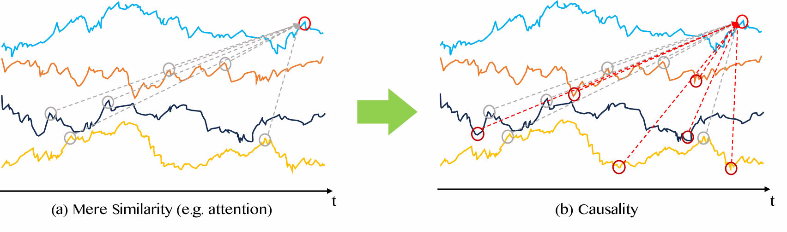
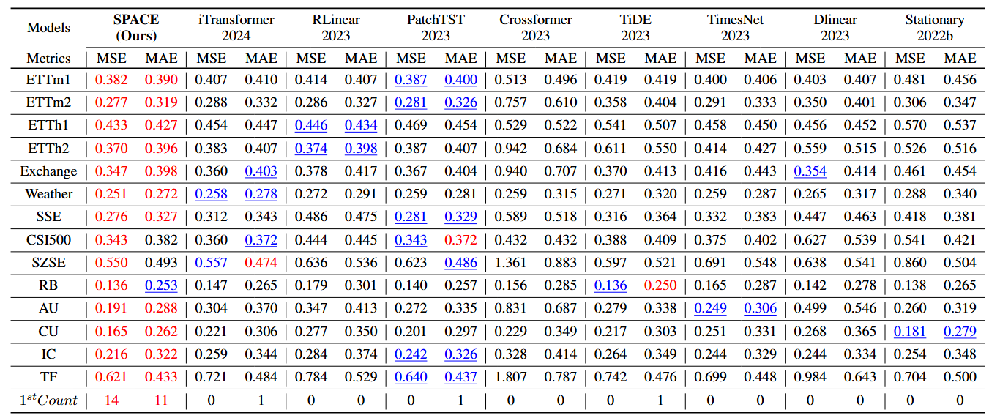

# CHAOS: Causality-Augmented Hybrid Architecture for Optimal Series Forecasting

## Overview

This repository presents the official PyTorch implementation of **CHAOS**, a novel statistical deep modeling framework for multivariate time series forecasting. CHAOS integrates **causal inference** with **temporal learning** via a modular architecture based on **deep learning, information theory, and graph neural networks**, which improved the disadvantage of existing attention based models that can only recognize correlations and ignore causal relationships.



---

## Key Features

* **Statistical Model Development**

  * Causal-based deep learning forecasting model
  * Efficient entropy-based computation module
  * Graph neural network-based integration of dependencies

* **Object-Oriented & Modular Code**

  * Modular implementation of CHAOS components (Cross-TE, CGNN, Sequence Enhancer)

* **Reproducibility and Debugging**

  * Fully documented pipeline with clear experimental reproducibility

* **Rich Visualization**

  * Includes causal graphs, entropy matrices, and performance plots

---

## Model Architecture: CHAOS

CHAOS is a modular deep learning framework designed to jointly model temporal dependencies and causal structures in multivariate time series. The architecture begins with a preprocessing pipeline that transforms raw input sequences into patchified embeddings, preserving fine-grained temporal information. These embeddings are refined through a Sequence Enhancer, which applies lightweight attention mechanisms to emphasize relevant patterns. To uncover the directional causal influence among variables, CHAOS computes a transfer entropy-based causality matrix using a novel Fast-pTE algorithm. This dynamic causality graph then informs a Causal Graph Neural Network (CGNN), which propagates information across series using weighted message passing with a 2D-mixing mechanism. The final forecast is produced by aggregating these enriched representations through a projection head. The entire pipeline is differentiable, end-to-end trainable, and achieves state-of-the-art performance on both benchmark and financial datasets.


---

## Experiments

* **Datasets**: 14 real-world datasets, including financial indices (SSE, CSI500), energy systems (ETT), and weather stations
* **Baselines**: Compared against 8 top-tier models (PatchTST, TimesNet, DLinear, iTransformer, etc.)
* **Metrics**: MSE / MAE across multiple forecasting horizons

> CHAOS achieved top-1 performance in **53/60 benchmark cases** and **49/80 financial datasets**.



## Run Example

```bash
python run_longeExp.py --dataset ETTh1 --model CHAOS --input_len 96 --pred_len 336
```
